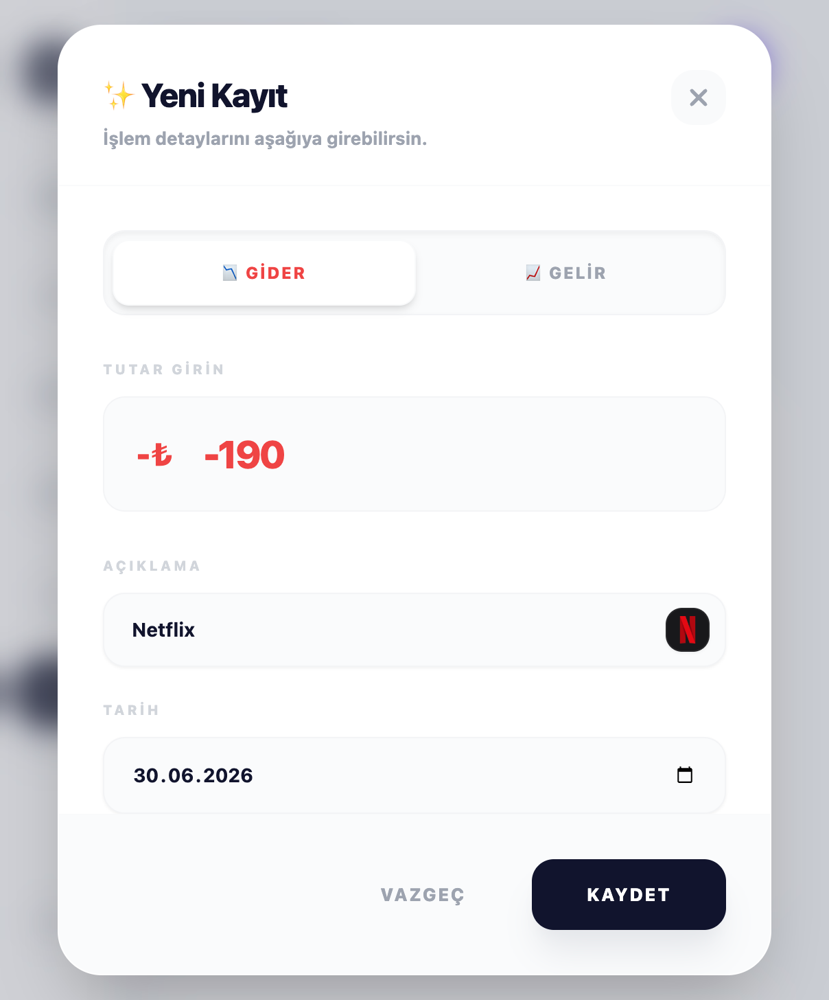
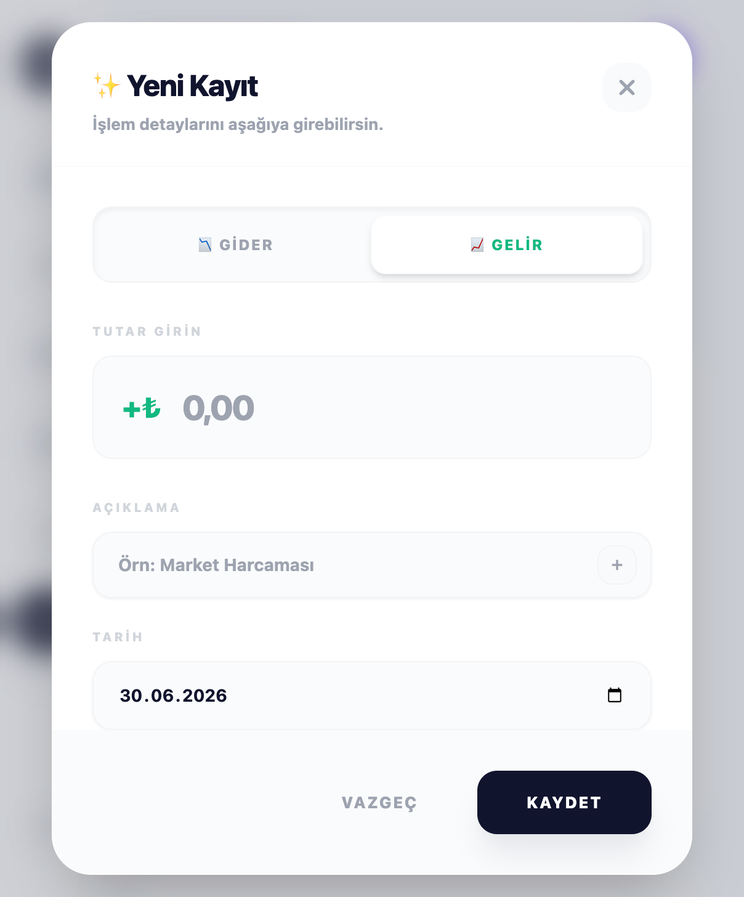
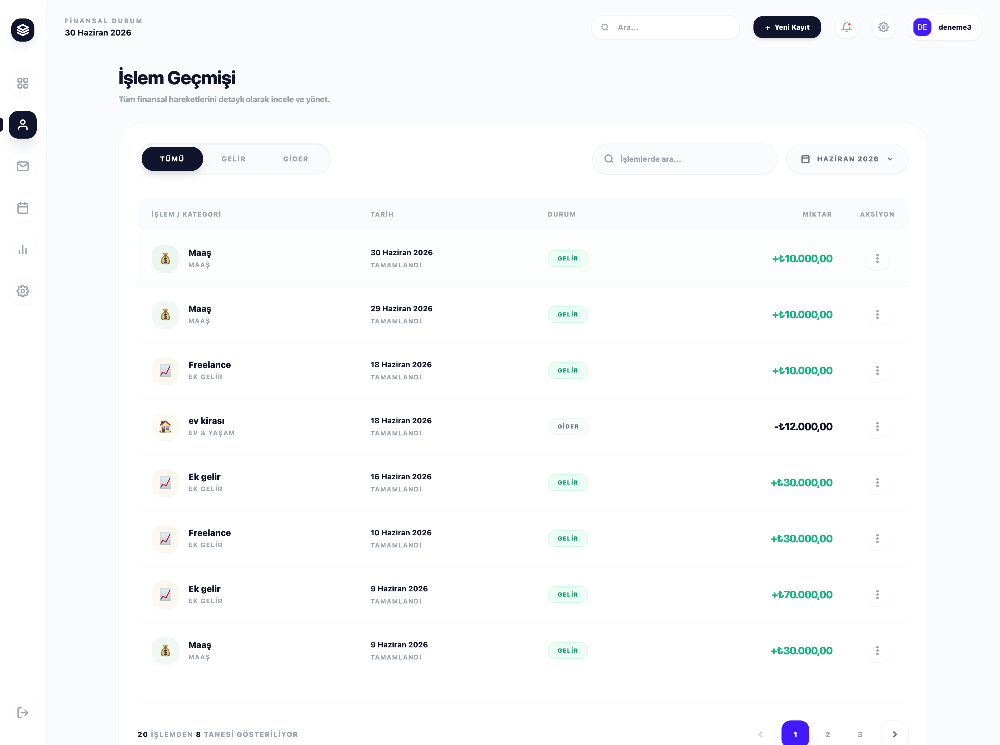

# 🚀 FinTech - Yeni Nesil Akıllı Finans Yönetimi (Web Uygulaması)

Modern tasarımı, yapay zeka destekli asistanı ve güçlü veritabanı altyapısıyla finansal hayatınızı tek bir yerden kontrol etmenizi sağlayan, uçtan uca akıllı bir gelir-gider takip ve bütçe planlama platformu.


## ✨ Projenin Güçlü Yönleri ve Mimari

### 🧠 Gemini 1.5 Flash Tabanlı İnteraktif AI Finansal Asistan
Uygulamamız, Google'ın en yeni ve performanslı dil modeli **Gemini 1.5 Flash** ile güçlendirilmiş entegre bir yapay zeka asistanına sahiptir. Klasik finans uygulamalarından farklı olarak projemiz veriyi sadece göstermez, yorumlar:
- **Akıllı Tasarruf Önerileri:** Harcama alışkanlıklarınızı analiz ederek size özel bütçe optimizasyon tavsiyeleri sunar.
- **Dinamik Bütçe Analiz Skoru:** Finansal sağlığınızı gerçek zamanlı olarak değerlendirir.
- **İnteraktif Soru-Cevap:** "Nasıl tasarruf edebilirim?", "En kritik harcamam ne?" gibi sorularınıza anında, veriye dayalı asistan yanıtları üretir.


### 📊 Detaylı Finansal Analiz ve Görsel Raporlama
Kullanıcıların finansal durumlarını en iyi şekilde analiz edebilmesi için gelişmiş grafik kütüphaneleri kullanılmıştır.
- **Gelir & Gider Akışı:** Belirli periyotlardaki nakit akışını interaktif bar grafiklerle karşılaştırmalı olarak sunar.
- **Kategori Dağılımı:** Harcamalarınızı (Ev & Yaşam, Abonelikler, Faturalar vb.) otomatik kategorize ederek dairesel grafiklerle (Pie Chart) oransal olarak gösterir.


### ⚡ Hızlı ve Pratik İşlem Ekleme Modülü
Kullanıcı deneyimi (UX) odaklı tasarlanan kayıt modülü sayesinde finansal hareketleri sisteme işlemek saniyeler sürer.
- Gelir ve Gider için optimize edilmiş, animasyonlu modal (popup) pencereleri.
- Kategori, tutar ve tarih seçimlerinin pratik bir arayüzle sunulması.




### 🗄️ Merkezi Supabase (PostgreSQL) Veritabanı Yapısı
Projenin veri mimarisi, modern ve ölçeklenebilir bir Backend-as-a-Service olan **Supabase** üzerine inşa edilmiştir.
- **Güçlü ve İlişkisel Altyapı:** PostgreSQL'in tüm gücüyle veri bütünlüğü sağlayan sağlam veritabanı şeması.
- **Gerçek Zamanlı (Real-time) Senkronizasyon:** Gelir/gider kayıtlarındaki değişikliklerin anında tüm grafiklere ve arayüze yansıması.


### 📝 Kapsamlı İşlem Geçmişi
Tüm finansal hareketlerinizi detaylı olarak inceleyip yönetebileceğiniz işlem tablosu. Gelir/gider filtrelemesi ve akıllı arama özellikleriyle aradığınız işlemi anında bulabilirsiniz.



### 📅 Gelişmiş Ödeme Takvimi ve Abonelik Yönetimi
Kullanıcıların nakit akışını en iyi şekilde yönetebilmesi için geliştirilen interaktif takvim modülü:
- Gelecek aylardaki ödemelerinizi takvim üzerinde görselleştirerek nakit darboğazlarını önceden tespit etmenizi sağlar.
- Netflix, Apple, Disney+ vb. tekrar eden aboneliklerin yıllık bazda maliyet analizini çıkarır ve tasarruf ipuçları sunar.


### ⚙️ Kişiselleştirilmiş Hesap Yönetimi
Kullanıcıların platform deneyimini özelleştirebileceği modern ayarlar sayfası. Profil, iletişim bilgileri, para birimi tercihleri ve bildirim izinlerinin tek bir merkezden yönetimi sağlanır.


---

## 🛠️ Kullanılan Temel Teknolojiler

- **Frontend:** React / Next.js (Modern, Glassmorphism ve dinamik animasyonlar)
- **Backend & Veritabanı:** Supabase (PostgreSQL)
- **Yapay Zeka:** Google Gemini 1.5 Flash API
- **Stil & Tasarım:** TailwindCSS, Özel Renk Paletleri

---

## 💻 Yerelde Kurulum Adımları (Geliştirici Rehberi)

Projeyi bilgisayarınızda çalıştırmak için aşağıdaki adımları sırasıyla izleyebilirsiniz.

1. **Projeyi Klonlayın ve Frontend Klasörüne Girin:**
   ```bash
   git clone <github-repo-linkiniz>
   cd web-gelir-takip/frontend-web
   ```

2. **Gerekli Paketleri (Dependencies) Yükleyin:**
   ```bash
   npm install
   ```

3. **Çevre Değişkenlerini (Environment Variables) Yapılandırın:**
   `frontend-web` dizininde bir `.env` (veya `.env.local`) dosyası oluşturun ve aşağıdaki değişkenleri kendi anahtarlarınızla doldurun:
   ```env
   NEXT_PUBLIC_SUPABASE_URL=senin_supabase_url_adresin
   NEXT_PUBLIC_SUPABASE_ANON_KEY=senin_supabase_anon_key_degerin
   GEMINI_API_KEY=senin_gemini_api_anahtarin
   ```

4. **Uygulamayı Başlatın:**
   ```bash
   npm run dev
   ```
   *Uygulama başarıyla başlatıldığında `http://localhost:3000` adresinden projeyi görüntüleyebilirsiniz.*

---

## ☁️ Bulut Mimarisi ve CI/CD Süreç Yönetimi

Projemiz, modern yazılım geliştirme standartlarına uygun olarak **ayrık mimari (decoupled architecture)** modeliyle AWS (Amazon Web Services) üzerinde canlıya alınmış ve uçtan uca otomatik bir **CI/CD (Sürekli Entegrasyon ve Dağıtım)** hattına bağlanmıştır.

### 🔄 GitHub Actions ile Tam Otomatik Pipeline
Geliştirme sürecinin hızlanması ve insan hatasının sıfıra inmesi için `.github/workflows/deploy.yml` üzerinden özel bir otomasyon tasarlanmıştır. Kod `main` dalına (branch) ulaştığı an 2 aşamalı bir dağıtım hattı başlar:

1. **Frontend Dağıtımı (AWS S3 Bucket):** 
   Arayüz projemiz GitHub runner'larında otomatik olarak derlenir (build). Ortaya çıkan optimize edilmiş statik dosyalar (dist) doğrudan **AWS S3 (Simple Storage Service)** servisindeki özel bir klasöre senkronize edilir. Bu sayede arayüz saniyeler içinde güncellenir ve kullanıcılara ışık hızında sunulur.
   
2. **Backend Dağıtımı (AWS EC2 & PM2):** 
   Frontend başarıyla yüklendikten sonra otomasyon, güvenli bir SSH tüneli kurarak ana sunucumuz olan **AWS EC2 (Elastic Compute Cloud)** instance'ına bağlanır. En güncel arka uç kodlarını çeker (git pull), paketleri günceller ve API sunucusunu **PM2** ile sıfır kesintiyle (zero downtime) yeniden başlatır.

### 🔒 Uçtan Uca Güvenlik (DevSecOps Yaklaşımı)
- Veritabanı anahtarları (Supabase), yapay zeka token'ları (Gemini) ve sunucu SSH (`.pem`) kimlikleri kod içerisinde asla barındırılmaz.
- Bütün hassas ortam değişkenleri **GitHub Secrets** kasasında yüksek şifrelemeyle saklanır ve sadece dağıtım (deploy) anında enjekte edilir.
